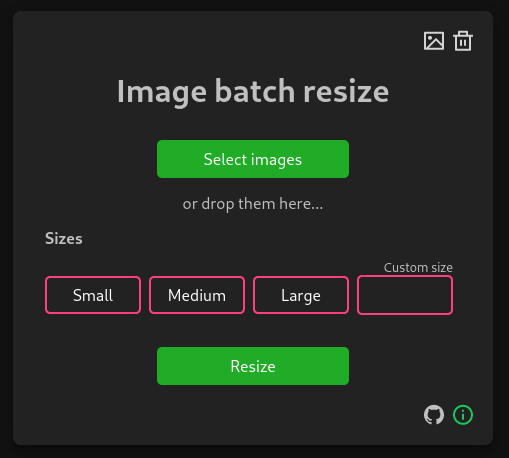

# Image Batch Resize

This tool is a pure javascript image resize tool and runs only in the browser. Free to use. Resize images before used on the web or other simple use case for image resizing.

🚀 **[Link to app](https://ahrberg.github.io/image-batch-resize/)**

## Contribute

Please open a pull request or create an issue to jump on in.

## TODO

- [x] Add progress bar
- [ ] Select output file type, png, webp, jpeg
- [ ] Make responsive and mobile friendly
- [ ] Improve drop zone to entire screen
- [ ] Show error messages
- [ ] Add app ico and app icons
